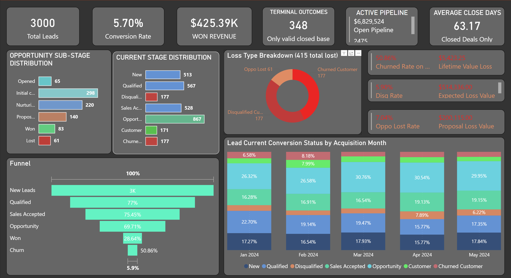
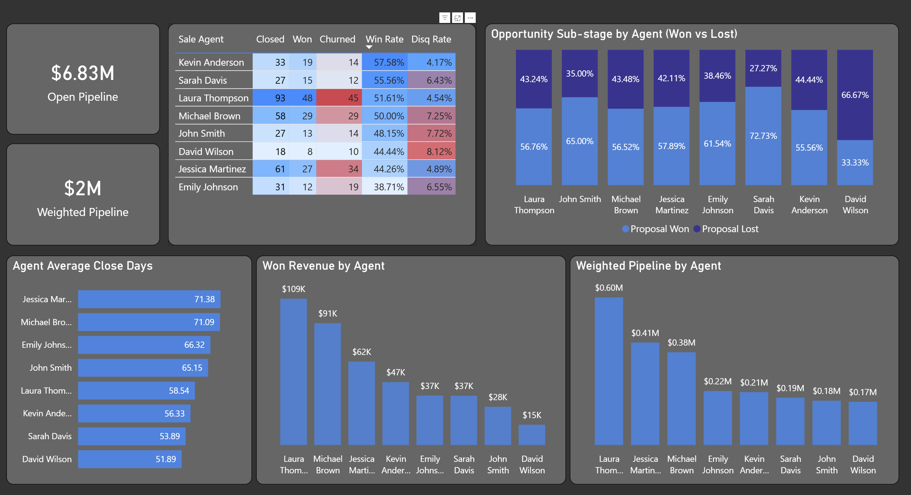
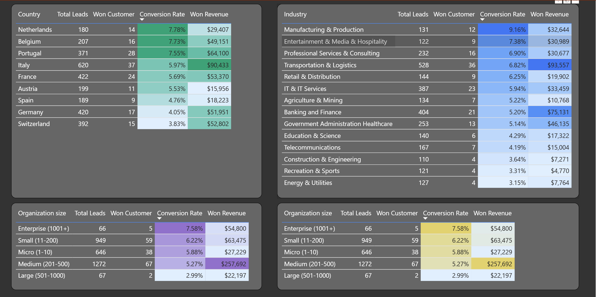

# 📊 CRM Sales Pipeline Analytics

A full-stack SQL + Power BI analysis of a B2B SaaS CRM pipeline covering **3,000 leads** across 9 European markets, 8 sales reps, and 3 product lines. The project delivers actionable insights across pipeline health, funnel bottlenecks, rep performance, geo/industry segmentation, and forecast accuracy.

> **Tools:** PostgreSQL · Power BI · DAX  
> **Dataset:** Synthetic CRM snapshot · Jan–May 2024 · 9 countries · 14 industries

---

## 📁 Repository Structure

```
crm-sales-pipeline-analytics/
│
├── data/
│   └── CRM_and_Sales_Pipelines.csv
│
├── sql/
│   └── Sales_Pipeline_Analytics.sql      # 6 sections, 18+ queries
│
├── dashboard/
│   ├── pipeline_snapshot.png             # Page 1 — Pipeline Health
│   ├── rep_performance.png               # Page 2 — Rep Performance
│   └── geo_industry.png                  # Page 3 — Geo & Industry
│
└── README.md
```

---

## ⚠️ Critical Data Caveat

> This dataset is a **single point-in-time snapshot** — each lead appears once, reflecting its current status. **Stage-to-stage conversion rates in the funnel should be read as current distribution, not true conversion paths.** Only the 348 closed deals (leads with an `actual_close_date`) support reliable win rate and time-to-close analysis.

---

## 📊 Dashboard Preview

### Page 1 — Pipeline Snapshot


### Page 2 — Rep Performance


### Page 3 — Geo & Industry


---

## 🔍 Analysis Sections

### 1 · Funnel Analysis & Bottleneck

The funnel uses cumulative counts — each stage total includes all downstream leads, matching standard waterfall funnel behaviour in BI tools.

```
Stage              Leads    % of Total    Drop to Next
───────────────────────────────────────────────────────
New Leads          3,000      100%
Qualified          2,310       77.0%       ↓ 23.0%
Sales Accepted     1,743       58.1%       ↓ 24.6%
Opportunity        1,215       40.5%       ↓ 28.5%
Won (incl churn)     348       11.6%       ↓ 71.4%   ← ‼ PRIMARY BOTTLENECK
  └ Churned          177       50.9% of Won
```

#### 🚨 Primary Bottleneck: Opportunity → Customer

**71.4% of leads that reach the Opportunity stage never convert.** This single drop dwarfs all earlier-stage losses combined and is the highest-leverage stage for sales intervention.

#### Secondary Bottleneck: Proposal Sent ($377K stalled)

| Sub-Stage | Deals | Pipeline Value | Avg Days Open |
|---|---|---|---|
| Initial contact | 298 | $859,994 | ~64d |
| Nurturing | 220 | $538,633 | ~71d |
| **Proposal sent** | **140** | **$377,102** | **~78d** ← stall point |
| Won | 83 | $183,955 | ~55d |
| Lost | 61 | $200,115 | ~80d |
| Opened | 65 | $136,060 | ~52d |

140 deals carrying $377K have been stalled at Proposal Sent the longest on average — the most at-risk concentration in the active pipeline.

---

### 2 · Rep Performance (n=348 closed deals)

> Win rate = Won / (Won + Churned). Denominator = closed deals only, not total assigned leads.

| Rep | Closed | Won | Win Rate | Disq Rate | Avg Close Days |
|---|---|---|---|---|---|
| Kevin Anderson | 33 | 19 | **57.6%** | **4.2%** | 56.3d |
| Sarah Davis | 27 | 15 | 55.6% | 6.4% | 53.9d |
| Laura Thompson | 93 | 48 | 51.6% | 4.5% | 58.5d |
| Michael Brown | 58 | 29 | 50.0% | 7.3% | 71.1d |
| John Smith | 27 | 13 | 48.1% | 7.7% | 65.2d |
| David Wilson | 18 | 8 | 44.4% | 8.1% | 51.9d |
| Jessica Martinez | 61 | 27 | 44.3% | 4.9% | 71.4d |
| Emily Johnson | 31 | 12 | 38.7% | 6.5% | 66.3d |

**Won Revenue & Pipeline by Rep:**

| Rep | Won Revenue | Weighted Open Pipeline |
|---|---|---|
| Laura Thompson | **$108,913** | $0.60M |
| Michael Brown | $90,658 | $0.41M |
| Jessica Martinez | $62,048 | $0.38M |
| Kevin Anderson | $46,800 | $0.22M |
| Emily Johnson | $36,798 | $0.21M |
| Sarah Davis | $36,667 | $0.19M |
| John Smith | $28,426 | $0.18M |
| David Wilson | $15,083 | $0.17M |

**Notable cross-signals:**
- **Kevin Anderson** holds the best win rate (57.6%) *and* lowest disq rate (4.2%) — consistent quality across two independent dimensions
- **Laura Thompson** generates the most revenue and has the largest closed deal sample (n=93), making her rates the most statistically reliable
- **David Wilson** is weakest across win rate, disq rate, and revenue — all three dimensions pointing the same direction

---

### 3 · Forecast Accuracy — Agents Are Not Overconfident

> One of the most actionable findings in this project.

Of 348 closed deals with both dates populated:

| Outcome | Count | Share |
|---|---|---|
| Closed **sooner** than expected close date | **308** | **88.5%** |
| Closed **later** than expected close date | 40 | 11.5% |
| Exact match | 0 | 0% |

**Agents consistently close deals earlier than their forecast date — they are setting conservative buffers, not overestimating their pipeline.** The average deal closes **131 days earlier** than the `expected_close_date` entered in the CRM.

| Rep | Avg Variance | % Closed Sooner | Note |
|---|---|---|---|
| Sarah Davis | **–187 days** | 96% | Most conservative |
| Michael Brown | –141 days | 91% | |
| John Smith | –138 days | 85% | |
| Emily Johnson | –128 days | 87% | |
| Laura Thompson | –128 days | 88% | |
| Kevin Anderson | –127 days | 88% | |
| David Wilson | –123 days | 83% | |
| Jessica Martinez | **–106 days** | 87% | Closest to accurate |

**Implication for forecasting:** Apply a **–131 day correction factor** when using open-deal expected close dates to project revenue timing. In Power BI, create a corrected date column: `Expected_close_date - 131 days` and use this as the basis for pipeline aging and quarterly close forecasts.

---

### 4 · Industry Performance

| Industry | Leads | Won | Conv Rate | Won Revenue |
|---|---|---|---|---|
| Manufacturing & Production | 131 | 12 | **9.16%** | $32,644 |
| Entertainment & Media & Hospitality | 122 | 9 | 7.38% | $30,989 |
| Professional Services & Consulting | 232 | 16 | 6.90% | $30,677 |
| Transportation & Logistics | 528 | 36 | 6.82% | **$93,557** |
| Retail & Distribution | 144 | 9 | 6.25% | $19,902 |
| IT & IT Services | 387 | 23 | 5.94% | $33,459 |
| Agriculture & Mining | 134 | 7 | 5.22% | $10,768 |
| Banking and Finance | 404 | 21 | 5.20% | $75,131 |
| Govt Admin Healthcare | 253 | 13 | 5.14% | $46,135 |
| Education & Science | 140 | 6 | 4.29% | $17,322 |
| Telecommunications | 167 | 7 | 4.19% | $15,004 |
| Construction & Engineering | 110 | 4 | 3.64% | $7,271 |
| Recreation & Sports | 121 | 4 | 3.31% | $4,770 |
| Energy & Utilities | 127 | 4 | 3.15% | $7,764 |

**Key insight:** Manufacturing & Production converts at **9.16%** — nearly 3× the rate of Energy & Utilities — from a relatively small lead pool (131). Transportation & Logistics is the revenue leader ($93K) but converts at a middling 6.82%, suggesting room to improve close rate at scale.

---

### 5 · Organisation Size

| Size | Leads | Won | Conv Rate | Won Revenue |
|---|---|---|---|---|
| Enterprise (1001+) | 66 | 5 | **7.58%** | $54,800 |
| Small (11–200) | 949 | 59 | 6.22% | $63,475 |
| Micro (1–10) | 646 | 38 | 5.88% | $27,229 |
| Medium (201–500) | 1,272 | 67 | 5.27% | **$257,692** |
| Large (501–1000) | 67 | 2 | 2.99% | $22,197 |

**Key insight:** Enterprise converts at the highest rate (7.58%) despite having the smallest lead pool — strong product-market fit signal at the top end. Large accounts (501–1000) are the weakest segment with only 2.99% conversion across 67 leads, suggesting a gap in the value proposition or sales approach for this specific tier.

---

### 6 · Product Performance

| Product | Leads | Won | Conv Rate | Won Revenue |
|---|---|---|---|---|
| SAAS | 1,295 | 75 | **5.79%** | $152,312 |
| Services | 1,147 | 66 | 5.75% | **$160,948** |
| Custom Solution | 558 | 30 | 5.38% | $112,133 |

Conversion rates are narrow across all three products (within 0.4pp), indicating product mix is not a meaningful differentiator in close rate. Services generates the highest total won revenue. Custom Solution carries the highest average deal value per closed win, making it the most valuable product on a per-deal basis.

---

### 7 · Geographic Performance

| Country | Leads | Won | Conv Rate | Won Revenue |
|---|---|---|---|---|
| Netherlands | 180 | 14 | **7.78%** | $29,407 |
| Belgium | 207 | 16 | 7.73% | $49,151 |
| Portugal | 371 | 28 | 7.55% | $64,100 |
| Italy | 620 | 37 | 5.97% | **$90,433** |
| France | 422 | 24 | 5.69% | $53,370 |
| Austria | 199 | 11 | 5.53% | $15,956 |
| Spain | 189 | 9 | 4.76% | $18,223 |
| Germany | 420 | 17 | 4.05% | $51,951 |
| Switzerland | 392 | 15 | 3.83% | $52,802 |

**Key insight:** Netherlands, Belgium, and Portugal all convert above 7.5% — the three highest-quality markets by conversion rate. Italy dominates on revenue ($90K) by volume. Germany and Switzerland are high-priority underperformers — both have large lead pools but sit at the bottom on conversion rate.

---

### 8 · Lost Opportunity Analysis

| Loss Type | Count | Avg Deal Value | Total Value at Risk |
|---|---|---|---|
| Churned Customer | 177 | $2,858 | ~$505K |
| Disqualified | 177 | $2,906 | ~$514K |
| Opportunity Lost (stage = Lost) | 61 | $3,281 | $200,115 |
| **Total loss exposure** | **415** | | **~$514K expected loss** |

The symmetry between Churned (177) and Disqualified (177) is significant — the pipeline is losing as many customers post-conversion as it is screening out pre-pipeline. This suggests a **customer fit problem**, not just a lead quality problem.

| Loss Metric | Rate |
|---|---|
| Churn Rate (of closed deals) | 50.86% |
| Disqualification Rate (of all leads) | 5.90% |
| Opportunity Lost Rate (of Opp stage) | 7.04% |

---

## 🛠️ SQL Techniques Used

| Technique | Where Applied |
|---|---|
| `CASE WHEN` conditional aggregation | Status bucketing, win/churn/disq rates across all sections |
| Multi-step CTEs | Funnel logic (§1.5), cohort resolution (§1.6) |
| `DATE_TRUNC` + `TO_CHAR` | Cohort month grouping and display formatting |
| `SUM() OVER (PARTITION BY)` | Sub-stage totals by rep (§4.6) |
| Date arithmetic | Avg days to close (§1.3, §4.3), forecast variance (§6) |
| `NULLIF` for division safety | All percentage rate calculations |
| Compound `WHERE` with AND/OR precedence | Lost opportunity filter combining Churned, Disq, and Opp Lost |

---

## 👤 Author

Built as a SQL + Power BI portfolio project demonstrating business-oriented analytical thinking on a realistic B2B CRM dataset.

*Synthetic data — not based on real company information.*
